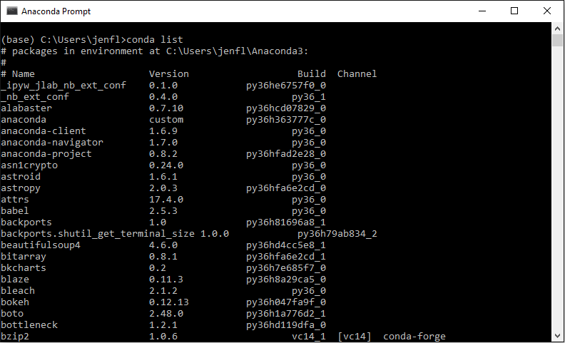
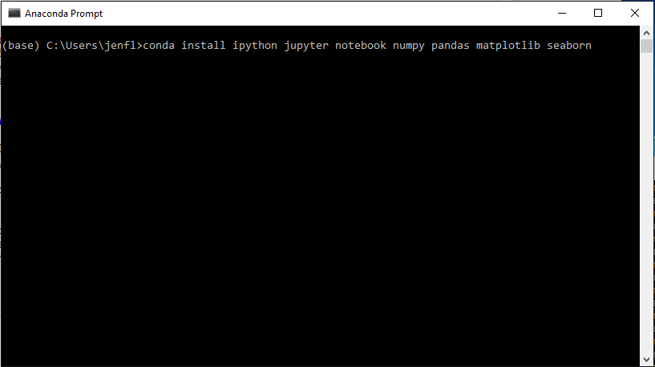

# Computer Setup Instructions

We'll be using Python 3.6, Jupyter notebook, `numpy`, `pandas`, `matplotlib`, and `seaborn`. If you're new to Python and/or data analysis is your main reason for using Python, I highly recommend using **Anaconda** to set up your environment. Anaconda is a Python distribution which includes core Python plus a package manager (`conda`) to manage all the 3rd party libraries you'll want to use when analyzing data.

Below are 3 options for setting up your laptop for the workshop:

### Option A: Full Anaconda Distribution

This option is the easiest but requires the most disk space. Select the **Python 3.6 version** for your operating system from the [Anaconda download page](https://www.anaconda.com/download/) and follow the installation instructions for [Windows](https://docs.anaconda.com/anaconda/install/windows) or [Mac](https://docs.anaconda.com/anaconda/install/mac-os).
You'll need about **3 GB of free disk space** to install the full Anaconda distribution (the exact space requirements will be listed when you start the installation process). 

With the full Anaconda distribution, you'll immediately have access to all the main data analysis libraries without having to find and install them yourself. Once you've installed Anaconda, look for a new program called "Anaconda Prompt" on your computer's menu, and run it to bring up a console window as in the screenshot below. You can type `conda list` at the prompt to show what libraries have been installed (it's a long list, so you'll need to scroll up to see the beginning of it, and your list will look a little different from the screenshot due to different versions and extra libraries I have on my system). If you scroll through your list, you should be able to spot `jupyter`, `matplotlib`, `numpy`, and `pandas`, among many others.

### Option B: Miniconda

If disk space is an issue, you can instead install Miniconda, which has minimal disk space requirements. Miniconda is a bare bones installation that includes just Python, the `conda` package manager, and a few libraries that `conda` needs. From the [Miniconda download page](https://conda.io/miniconda.html), download the **Python 3.6 version** for your operating system, and follow the [installation instructions](https://conda.io/docs/user-guide/install/index.html). Once you've installed Miniconda, you can see what libraries are included by following the instructions listed above in Option A to open an Anaconda Prompt console and type `conda list`. The list will be pretty short.

To use any other 3rd party libraries, you'll need to install them yourself with `conda`. For the workshop, you'll want to set up a mini data analysis ecosystem for yourself, by running the command `conda install ipython jupyter notebook numpy pandas matplotlib seaborn` in the Anaconda Prompt as in the screenshot below. Follow the prompts to confirm that you want to download and install these libraries, and `conda` will do the rest for you.

Then you can type `conda list` again at the prompt, and confirm that the new libraries have been installed. As you continue to explore Python and want to try out more libraries, you can install them using the `conda install` command in the Anaconda Prompt.

### Option C: Installation with `pip`

If you already use `pip` and prefer to use it for package management, go forth and do your thing! You'll want a Python 3.6 environment with `ipython`, `jupyter`, `notebook`, `numpy`, `pandas`, `matplotlib`, and `seaborn`.

[back to workshop main page](https://jenfly.github.io/pydata-intro-workshop/)
