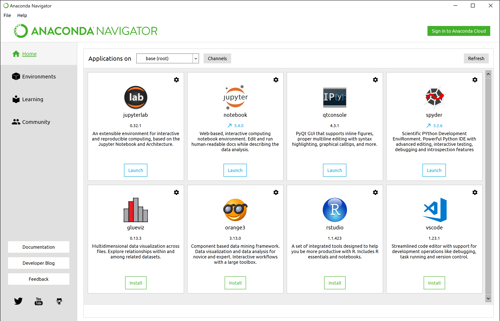
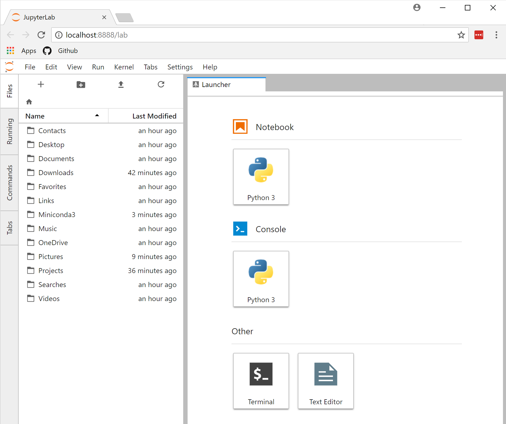
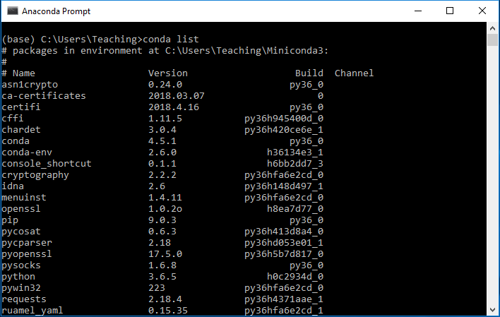
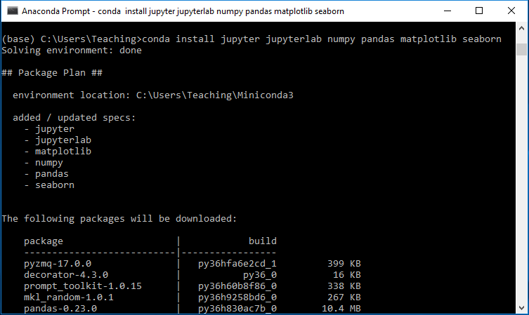
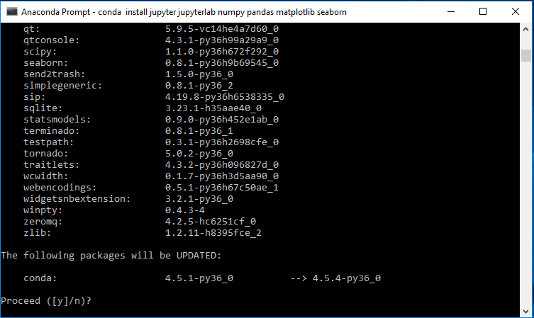
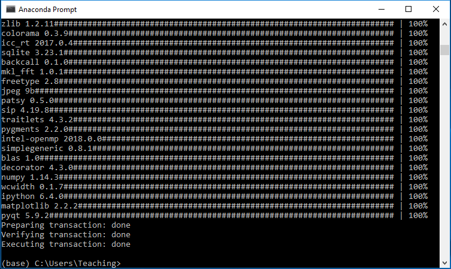

# Computer Setup Instructions

We'll be using Python 3.6, `jupyterlab`, `numpy`, `pandas`, `matplotlib`, and `seaborn`. If you're new to Python and/or data analysis is your main reason for using Python, I highly recommend using **Anaconda** to set up your environment. Anaconda is a Python distribution which includes core Python plus a package manager (`conda`) to manage all the 3rd party libraries you'll want to use when analyzing data.

Below are a few different options for setting up your laptop for the workshop. Since we'll be working with a powerful suite of tools, comparable to Excel or other software, the disk space requirements are significant&mdash;you'll need at least **4 GB of free disk space**.

You'll want to have the software installed and working properly before the workshop starts. Sometimes a few minor tweaks are needed to get the software working on different systems, so if you have any problems please email me (jenfly@gmail.com) to help you sort things out.

### Option A: Full Anaconda Distribution

This option is the easiest to set up and start using, especially if you don't have much experience working in the Command Prompt (Windows) or Terminal (Mac). However, this option **requires the most disk space&mdash;just under 6 GB** on Windows and I'm assuming similar on a Mac.

#### Step 1: Download and Install

Download the **Python 3.6 version** for your operating system from the **[Anaconda download page](https://www.anaconda.com/download/)** and run the installer, making sure to use all the recommended default settings. It could take up to half an hour to install, so once you've walked through the initial prompts and clicked "Install", you might want to grab some lunch or go for a walk, leaving your laptop plugged in so it doesn't try to go to sleep.

For more details on the intallation steps, you can check out the instructions for [Windows](https://docs.anaconda.com/anaconda/install/windows) or [Mac](https://docs.anaconda.com/anaconda/install/mac-os). *Note: the Windows installer says 3 GB free space is required, but on my computer I found that the software uses almost double that. These numbers might be a bit different on Mac.*

Once you've installed the full Anaconda distribution, you'll immediately have access to all the main data analysis libraries without having to find and install them yourself!

#### Step 2: Test Your Installation

To make sure the software is working properly, look for a newly installed program called "Anaconda Navigator" in your computer's menu, and run it to open up a window similar to the screenshot below. It might take a minute to initialize, and a few other windows might open and close while it's doing so, this is all normal. If a dialog box pops up that says there's a newer version available, click "OK" and let it update and restart itself.




We'll be using a program called Jupyter Lab, so you'll want to make sure it's working. Select `jupyterlab` from the Anaconda Navigator dashboard and a new tab should open up in your default web browser, which will look similar to the screenshot below. If so, success!  You're all set! You can start exploring Jupyter Lab if you want, or just close the browser tab and close the Anaconda Navigator window to exit the program.

<a id="jupyterlab"></a>




### Option B: Miniconda

If you want a more minimal installation and prefer to run programs from the command line instead of a graphical interface, you can instead install Miniconda, a bare bones version of Anaconda that includes just Python, the `conda` package manager, and a few libraries that `conda` needs. You'll then need to use `conda` to install the other 3rd party libraries that we'll be using in the workshop. For this option, you'll need about **4 GB** free disk space.

#### Step 1: Download and Install Miniconda

Download the **Python 3.6 version** for your operating system from the **[Miniconda download page](https://conda.io/miniconda.html)** and run the installer, making sure to use all the recommended default settings. This installation is much quicker than the full Anaconda distribution and will probably only take a few minutes.


#### Step 2: Install 3rd Party Libraries

Next, you'll need to check your Miniconda installation and then install several 3rd party libraries using `conda`. If you're on Windows, look for a newly installed program called "Anaconda Prompt" and run it to open up a console similar to the screenshot below. If you're on a Mac, look for a program called "Terminal" in the Launchpad, and run it to open a console window.

In either the Windows or the Mac version of the console, type `conda list` and then hit `Enter` to display a list of the currently installed libraries, as in the screenshot.



To install the libraries you'll need for the workshop, enter the following command in your console window:
```
conda install jupyterlab numpy pandas matplotlib seaborn
```

After a moment, you'll see a bunch of text flash by in the console window. If you scroll up to where you entered the command, you should see something similar to this:


And then if you scroll back down to the end of the text on the screen, you should see something similar to this:



Type `y` and hit `Enter` to confirm that you want to download and install these libraries, and `conda` will do the rest for you. When it's finished installing, you should see something similar to this:



Then you can run the command `conda list` again in the console, and scroll through the (now much longer) list to confirm that the new libraries have been installed. As you continue to explore Python and want to try out more libraries, you can install them using the `conda install` command in the console.

#### Step 3: Test Jupyter Lab

We'll be using a program called Jupyter Lab, so you'll want to make sure it's working. In the console window, run the command `jupyter lab`. A new tab should open up in your default web browser, which will look similar to the screenshot [shown above in Option A](#jupyterlab). If so, success!  You're all set! You can start exploring Jupyter Lab if you want, or just close the browser tab and close the console window to exit the program.


### Option C: Installation with `pip`

If you already use `pip` and prefer to use it for package management, go forth and do your thing! You'll want a Python 3.6 environment with `jupyterlab`, `numpy`, `pandas`, `matplotlib`, and `seaborn`.

[back to workshop main page](https://jenfly.github.io/pydata-intro-workshop/)
